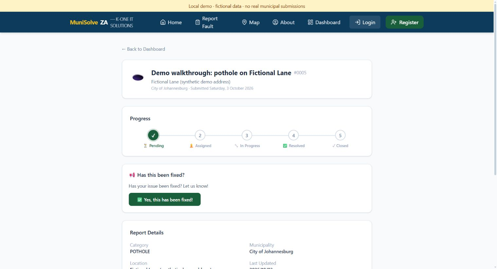

# MuniSolve ZA

A South African civic-tech portfolio project by **Kone Tshivhinda**. Citizens report infrastructure faults and track their reports; supervisors assign crews and record progress; municipal administrators manage reports and users.

**Try the [synthetic local walkthrough](docs/DEMO.md).** It runs the actual React interface, Express API and PostgreSQL database with fictional accounts, without requiring AI, email, weather or Google credentials.



## Demonstrated features

- Citizen fault submission with category, municipality and a map location.
- Own-report access: another citizen cannot open, edit or delete a report.
- Supervisor triage, crew suggestions, assignment, progress and resolution.
- A required after-photo URL on the supervisor resolution endpoint.
- Municipal admin report and user management, with an activity-log API.
- JWT authentication, bcrypt passwords, current database role/account checks, Helmet headers, CORS and rate limits.
- Optional Siyanda (Anthropic), Resend email verification, Google sign-in and weather integrations; public map, holiday and air-quality widgets.

The reproducible path is `PENDING → ASSIGNED → IN_PROGRESS → RESOLVED → CLOSED`.
This is a demonstrated workflow, not a strict state machine enforced by every endpoint. Admin endpoints allow direct status changes; citizens may confirm their own pending or in-progress reports as resolved.

## Stack

| Layer | Technology |
|---|---|
| Runtime | Node.js 22.12+; Express 5 |
| Data | PostgreSQL; Prisma 6 |
| Interface | React 19; Vite 7; Tailwind CSS 4; React Router 7 |
| Maps | Leaflet; React Leaflet; OpenStreetMap |
| Optional providers | Anthropic; Resend; Google OAuth; WeatherAPI |

## Reproduce the workflow

Install Node.js 22.12+ and Docker, then:

```sh
git clone https://github.com/konethegreat/munisolve-za.git
cd munisolve-za
npm --prefix server ci
npm --prefix client ci
npm --prefix server run demo:verify
```

Verification creates a new PostgreSQL 16 container, seeds four fictional users and two crews, starts the real API, checks 34 HTTP steps, and removes its processes and database. It checks permissions, every lifecycle state, missing-photo rejection, keyless reporting and audit history. Credentials are generated per run and are not saved to files or printed.

For the interactive interface, set a temporary `DEMO_PASSWORD` of at least 12 characters and run `npm --prefix server run demo`. The launcher prints a local login URL. [The walkthrough](docs/DEMO.md) has shell commands, accounts, expected results and screenshots. Stop with Ctrl+C to discard that database.

## Checks

```sh
npm --prefix server audit --audit-level=low
npm --prefix client audit --audit-level=low
npm --prefix server test
npm --prefix server run demo:verify
npm --prefix client run lint
npm --prefix client run build
```

GitHub Actions runs both dependency audits, API tests with stubbed external dependencies, the actual PostgreSQL HTTP workflow, and client lint/build. Audits include development dependencies and fail on findings of any severity. The browser walkthrough is a separate manual check; CI does not automate the UI.

## Regular local development

Use your own development PostgreSQL database and untracked `server/.env` with `DATABASE_URL`, a random `JWT_SECRET`, `CLIENT_URL=http://localhost:5173` and `NODE_ENV=development`. Provider credentials are optional for basic reporting: without them AI chat is unavailable and email verification cannot deliver mail.

```sh
npm --prefix server run db:push
npm --prefix server run dev
```

In another terminal, run `npm --prefix client run dev`. The client defaults to `http://localhost:5000/api`; use `VITE_API_URL` to change it. Configure `VITE_GOOGLE_CLIENT_ID` and matching server `GOOGLE_CLIENT_ID` to enable Google sign-in. The current schema is managed with `prisma db push`; hosted databases do not have synchronized migration history.

The server uses Node's built-in watch mode to restart when imported source files change. Restart it manually after changing environment variables or the Prisma schema.

## Roles and API entry points

| Role | Demonstrated access |
|---|---|
| `CITIZEN` | Own reports; no admin or supervisor endpoints |
| `WORKER_SUPERVISOR` | Operational reports and crews through `/api/supervisor`; no admin endpoints |
| `MUNICIPAL_ADMIN` | Admin and supervisor endpoints |
| `SUPER_ADMIN` | Admin and supervisor endpoints |

Auth: `/api/auth`; citizen reports: `/api/reports`; operations: `/api/supervisor`; administration: `/api/admin`; chat: `/api/ai`; public widgets: `/api/public`. `/health` checks API availability. Audit records are available through `/api/admin/activity-logs`; the current admin interface has reports and users tabs.

## Evidence and limits

[Demo evidence](docs/DEMO.md#recorded-evidence) covers a local synthetic workflow. It does not verify the hosted Vercel/Render/Neon deployment, real municipal receipt or repairs, AI answers, email delivery or Google OAuth. The photo field stores a URL; the demo uses a placeholder rather than a verified upload. Status updates are seen after navigation or refresh. Municipal admins currently have global report visibility; municipality names are not tenant isolation.

The October 3, 2026 dependency refresh reduced the server and client npm audit results from 17 findings each to zero. [Dependency maintenance notes](docs/DEPENDENCIES.md) explain the Prisma override and how to reproduce the checks. This records known npm advisories on that date; workflow tests and dependency audits do not establish complete application security.

## Developer

**Kone Tshivhinda** — Full-stack developer, Johannesburg, South Africa.

- [LinkedIn](https://za.linkedin.com/in/kone-tshivhinda-32a760233)
- [Email](mailto:erictshivhinda@gmail.com)

© 2026 Kone Tshivhinda. All rights reserved. Proprietary software for portfolio evaluation.
