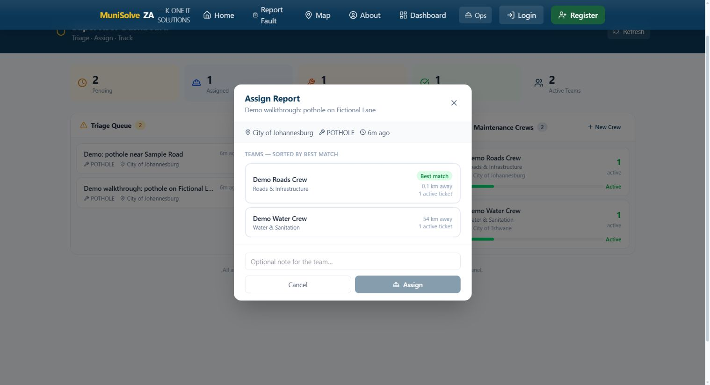
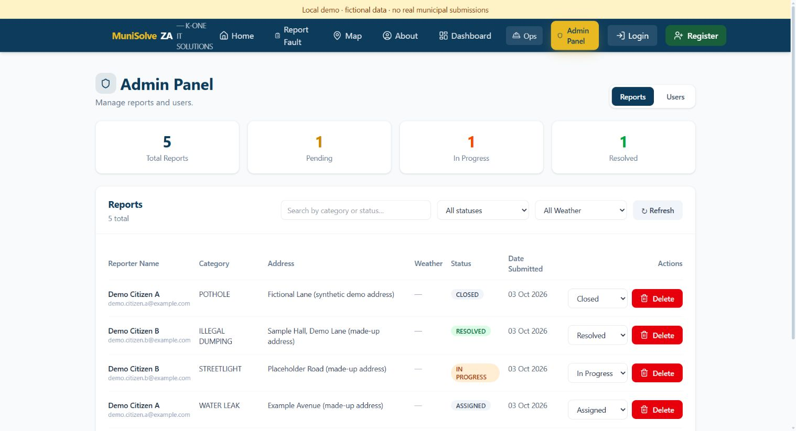
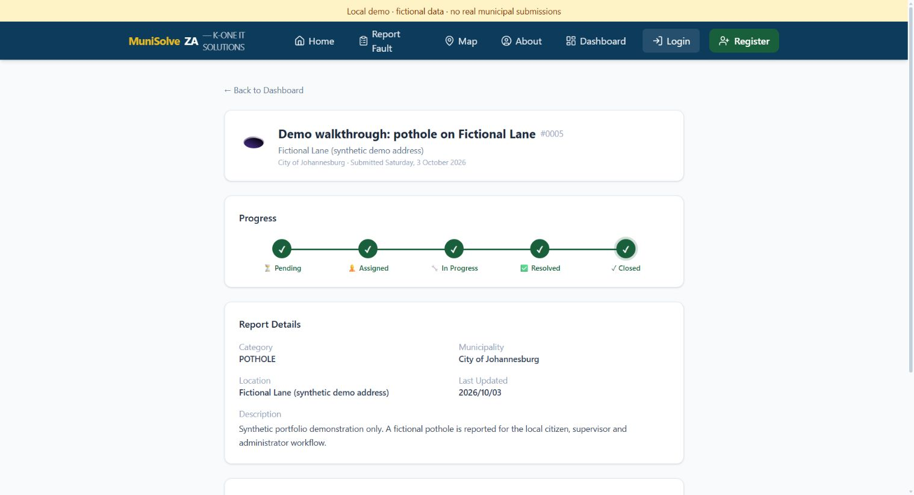
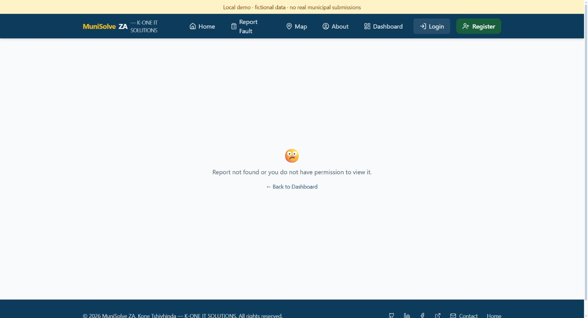

# Synthetic citizen-to-admin walkthrough

This runs the actual app with a new PostgreSQL 16 database. All people, crews,
addresses and faults are fictional. Johannesburg coordinates are sample map
coordinates, not a report of an incident.

## Start a fresh demo

Prerequisites: Node.js 22.12+, npm and a running Docker engine. From the repo root:

```sh
npm --prefix server ci
npm --prefix client ci
```

Choose a temporary password of at least 12 characters. In PowerShell 7:

```powershell
$env:DEMO_PASSWORD = Read-Host 'Temporary demo password (12+ characters)' -MaskInput
npm --prefix server run demo
Remove-Item Env:DEMO_PASSWORD
```

Or in Bash:

```bash
read -rs -p 'Temporary demo password (12+ characters): ' DEMO_PASSWORD
export DEMO_PASSWORD
npm --prefix server run demo
unset DEMO_PASSWORD
```

Open the printed `http://127.0.0.1:<port>/login` URL. Every launch uses new ports,
a new database and a fresh JWT secret. The four accounts share your temporary
password; it is neither printed nor written to a file.

| Account | Role | Starting data |
|---|---|---|
| `demo.citizen.a@example.com` | Citizen A | Own pending pothole and assigned water leak |
| `demo.citizen.b@example.com` | Citizen B | Two different own reports |
| `demo.supervisor@example.com` | Worker supervisor | Triage, active work and two crews |
| `demo.admin@example.com` | Municipal admin | All four reports and four users |

These accounts are pre-verified, so no email delivery is needed. The launcher
clears inherited AI, Resend, weather and Google credentials. Its
`VITE_DEMO_MODE=true` enables the fictional location button and local-demo banner;
normal development does not enable them.

Maps and keyless holiday/air-quality widgets may contact public services. This
walkthrough does not use browser geolocation, real street autocomplete, provider
sign-in, AI inference, email delivery or a hosted database.

## Walk through a report

1. Sign in as **Citizen A**. Open **Report Fault**. Enter
   `Demo walkthrough: pothole on Fictional Lane`, choose **Pothole** and **City of
   Johannesburg**, click **Use fictional demo location**, and enter a description
   explicitly saying this is synthetic. Submit and open the new report from
   the dashboard. Note its reference number; a fresh demo normally gives #0005.
   The progress is **Pending**.
2. While signed in as Citizen A, navigate to `/admin`. It redirects to
   `/dashboard`. The API independently denies citizen admin and supervisor calls
   with 403; `demo:verify` checks this.
3. Use the dashboard **Logout** button. Sign in as **Supervisor**, open **Ops**
   (`/supervisor`), and click the new report in **Triage Queue**. Select **Demo
   Roads Crew** and click **Assign**. It moves to **Active Reports** as **Assigned**.
4. Click the report in **Active Reports**, choose **In Progress**, and save.
   Next choose **Resolved** without a photo URL: the interface/server require
   one. Use `https://example.invalid/synthetic-after.jpg` and save **Resolved**.
   This deliberately invalid placeholder is not a repair photo or an upload.
5. Return to `/dashboard`, log out, and sign in as **Admin**. Open `/admin`,
   find the new report, and choose **Closed** in its status selector.
6. Log out via `/dashboard`, then sign in as **Citizen A**. Open the same
   reference. All five timeline stages are complete and the status is **Closed**.
   Refresh or navigation retrieves the server's current status.
7. Log out and sign in as **Citizen B**. Their dashboard shows only their two
   different reports. Open `/reports/<new-reference-number>` directly: it shows
   the permission/not-found message without the report's contents.

## Run the automatic check

```sh
npm --prefix server run demo:verify
```

Verification needs no supplied password: it generates one without printing it.
It checks 34 real HTTP steps against Express, Prisma and PostgreSQL: four logins,
wrong-password rejection, anonymous and role denial, report creation, every
status as seen by the owner, another citizen's denied read/edit/delete, crew
suggestions and assignment, missing-photo rejection, unavailable keyless chat,
closure, aggregate counts and five audit events in order.

Failures exit nonzero. The launcher removes its own processes and container on
normal completion or handled interruption. It does not use the developer's
`DATABASE_URL`. Running this alongside the interactive demo creates an independent
database. The API is bound to loopback and uses real account/password authentication.

## Stop and repeat

Press **Ctrl+C in the launcher terminal**. It stops its API and Vite processes
and removes its named database container and synthetic data. Starting again
resets the demonstration; no persistent volume is used. A forced process kill
or abrupt machine shutdown can bypass cleanup. If necessary, remove only the
leftover container named `munisolve-demo-...`, labelled
`munisolve.disposable-demo=true`.

## Recorded evidence

Recorded 3 October 2026 on Windows using the real local React/Express app and
PostgreSQL 16. Automatic verification passes all 34 HTTP steps. The manual
browser check covers submission, citizen admin redirect, crew assignment,
starting work, resolution, admin closure, the citizen's final timeline and
another citizen's denied direct link. Screenshots contain fictional data only.










GitHub Actions separately runs 75 Node tests with stubbed external services,
this real PostgreSQL HTTP workflow, and client lint/build. Browser checks are
manual. Neither layer establishes hosted deployment, municipal delivery,
AI answers, email delivery, OAuth sign-in, photo authenticity or actual repairs.

Admin routes permit direct status changes. The supervisor endpoint checks the
presence of a photo URL rather than its authenticity. This demonstrates one
workflow and selected authorization failures, not universal transition policy,
municipality isolation or a full security assessment.
